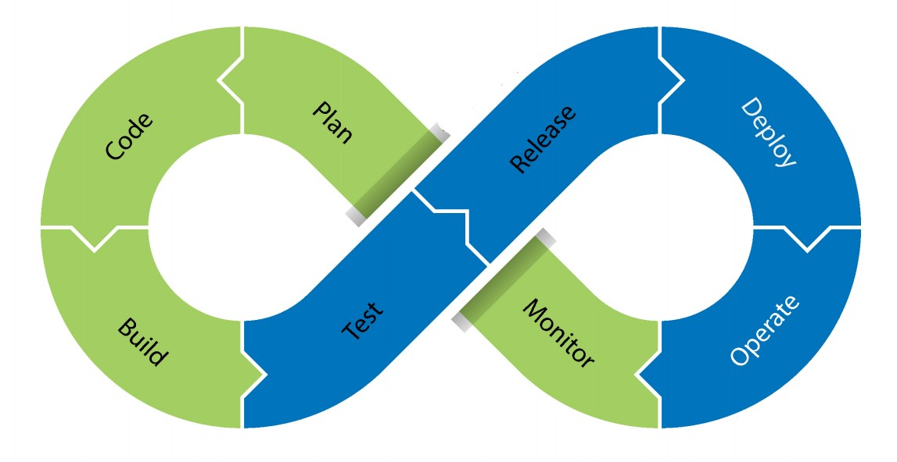
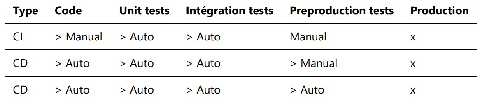
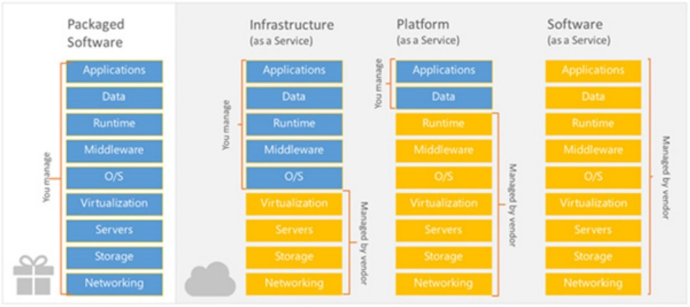
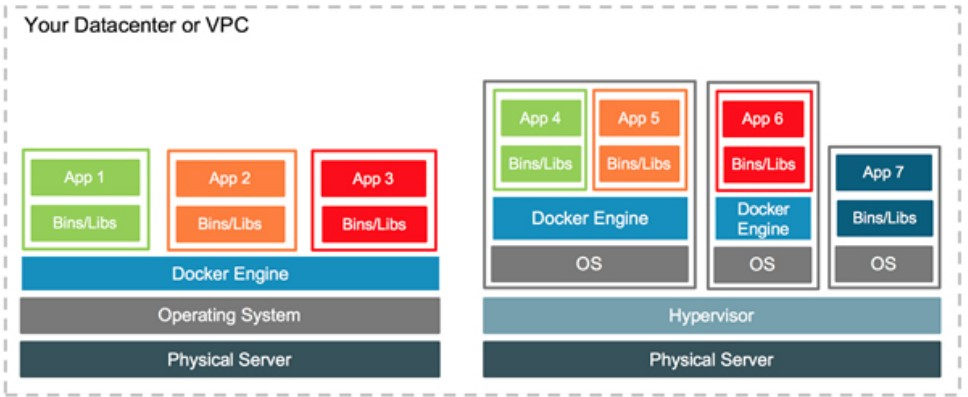

# Notes DevOps

## Qu'est-ce que le DevOps (C'est quoi le DevOps) :
- Un culture plutôt qu'une technique
- Collaboration d'équipe Dev, Ops et peut-être Secu
- Basé sur le partage et le respect
- Pas d'erreurs, juste apprendre
- Basé sur l'agilité

---
Env + Time => Dev to Ops
Quality + Test => Ops to Dev

---
## DevOps (il n'y a pas de définition "claire")
1. Méthodologie / Mouvance + qu'une pratique (== agilité)
2. Principes Généraux :
    1. Amener + rapidement le code en production : Livrer plus rapidement, plus souvent
    2. "Sécuriser" les livraisons : limiter bug, boucle feedback
    3. Automatisation
    4. Partage : Amélioration continue

### Les fondamentaux

#### CALMS
- Culture
- Automation
- Lean
- Mesure
- Share

### Comment faire

- Réduire & Optimiser la "supply chain"
- Optimiser les ressources
- Augmenter la qualité & SLA (Service-level agreement aka "entente de niveau de service") ( il s'agit de clauses basées sur un contrat définissant les objectifs précis attendus et le niveau de service que souhaite obtenir un client de la part du prestataire et fixe les responsabilités. )
- Culture
---
## Supply chain
- Standardiser les livraisons
- Intégration continue
- Livraison continue
- Deploiement continu
---
## Pipeline DevOps

---
## Supply Chain
> Penser au futur
- Pourquoi ? Maintenabilité ?
> Faire simple
- Faire ce pourquoi c'est designé et garder les choses simple
> Architecture de Microservices
- Réduire les dépendances entre les parties du développement augmente la maintenabilité
> Paternes
- Design logiciel (singleton, abstract…)
> Versioning
- Plus simple à évoluer
- Essayer est la clé

---
## Continuous Supply chain

---
## Cloud : Public / Private
- Cloud
- Virtuel
- Autoscalable
- Automatisation & Orchestration

### Cloud computing

---
## Cloud types
> Privé
- Infrastructure interne
> Publique
- Azure / AWS / GCP / ...
> Hybride
- Interne & Externe

---
## Pourquoi virtualiser ?
- Economies à l’achat et à la maintenance Un « gros » serveur coûte moins cher que de nombreux « petits » Maintenance matérielle simplifiée
- Optimisation de l’utilisation des ressources Mieux vaut un « gros » serveur utilisé en moyenne à 90% que 5 ou 6 « petits » utilisés à 15%
- Simplification des évolutions d’infrastructure Déploiement de nouvelles VM plutôt qu’achat de nouvelles machines (test, pré-prod ou prod)
- Facilité de gestion des environnements de développement Mise à disposition de VM de dév iso-production qu’installation sur les postes des développeurs ou sur un serveur central
- Virtualisation matérielle Support de la virtualisation intégrée ou assistée par le processeur ; ex : IBM Power, AIX, Intel VT…
- Hyperviseur de type 1 (nati ou baremetal) Noyau système hyper-léger gérant les accès des OS « virtuels » au matériel ; meilleures performances avec des OS optimisés ; ex : Citrix Xen Server, VMWare ESXI, MS Hyper-V Server…
- Hyperviseur de type 2 (hosted) Exécuté sur l’OS hôte et gérant le matériel pour les OS « virtuels » de façon transparente ; permet l’exécution de tous types d’OS ; ex : MS VirtualPC & Virtual Server, Oracle VirtualBox, VMWare Workstation…
- Virtualisation par container Isolement des processus dans un espace de nom virtualisé, leur donnant l’illusion d’être seuls sur la machine (ex : Docker…)

---
## Comment faire ?

Le container docker n'est pas un environnement OS complet. Container :
- Isolation process : RAM / CPU / ...
> Provisioning
- Physical allocation
- Ansible
- Chef
- Puppet
- Powershell ...
> Bare metal
- Install
- Configure
> Provisionning VM
- Terraform
- Shell
- CLI
> Container
- Distribute and deploy
- Lighter

---
## Autoscaling
> VM
- Dynamic attribution of RAM, Disk, ...
> Cloud
- More instance
> Container
- Horizontal scalability